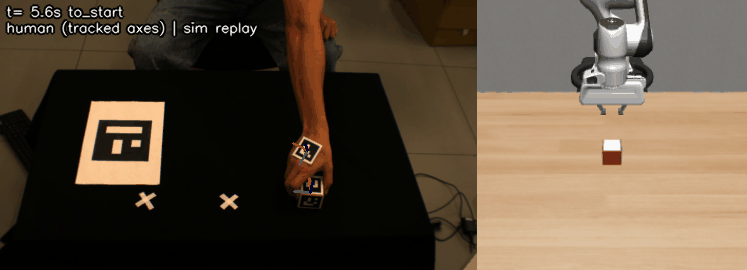
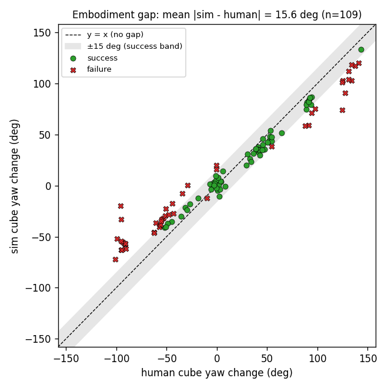
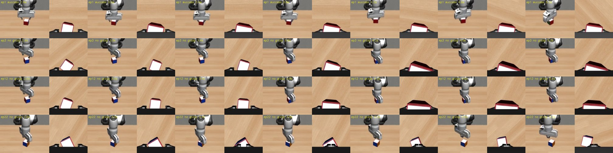
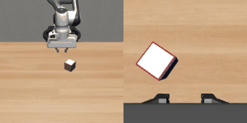
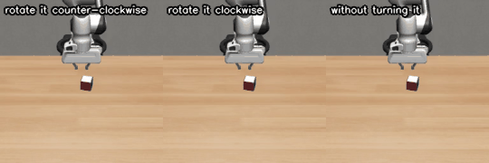

# From my hand to a robot arm: turning a cube

Following the directives given by Humanoid where I needed to train a world model and a VLA using self filmed videos as a guiding policy this is what I have done:

I filmed my own hand picking up a Rubik's cube, turning it, and putting it back down. I tracked the hand and the
cube in 3D using ArUco markers, replayed the motion on a simulated Panda arm, and measured where the robot does something different from
my hand. Then I trained a small world model on my data, used it to plan, and fine-tuned a vision-language-action
model (SmolVLA) to do the task from camera images, eventually from three different sentences.

Everything robot-side happens in simulation (robosuite). The data is 109 short videos of my hand.



## Results summary

| | Result |
|---|---|
| Clips recorded / usable for replay | 109 / 109 |
| Sim replay, gripper turns like my hand | 63/109 (58%) succeed |
| Sim replay, gripper turns like the cube | 96/109 (88%) succeed |
| How much more the cube turns than my hand | 1.16x counter-clockwise, 1.51x clockwise |
| World model, best learned model vs simple gain | 12.2 vs 9.2 deg error (the gain wins) |
| Planning with the world model vs naive plan | 65% vs 100% |
| SmolVLA, one instruction, 50 new cube poses | 84% (two runs: 42/50 and 42/50) |
| SmolVLA, three instructions, same 50 poses | 76% / 40% / 88% |

A replay or policy episode counts as a success when the cube is lifted at least 2 cm, put back within 3 cm, and
turned within 15 degrees of the target.

## Setup

- **Cameras:** I used a calibrated stereo camera pair that was used in a previous project, I faced the cameras and used a black table to reduce image noise. They record at
  30 fps. Using two cameras helped me reduce the error on depth for the videos.
- **Markers:** ArUco markers on the table (the world frame), on a carton piece stuck on the back of my hand, and on five faces
  of a classic Rubik's cube.
- **Recordings:**
  - 75 clips where I turn the cube on the spot by -90 to +120 degrees, on three marked spots;
  - 18 clips where I carry it to another spot;
  - 16 clips where I tried to do the movement faster to limit test the robot.

## How it works, and what went wrong along the way

### 1. Tracking (`src/track.py`, `src/stereo.py`)

**How it works:**
- Every frame, both cameras detect the markers.
- The cube's pose is the one that best explains the marker corners seen by both cameras at once. The hand's pose
  is found the same way.
- One camera alone is fine for the yaw angle (0.2 degree error) but not for position, so positions only come from
  frames that both cameras see.

**Problems I hit:**
- **The top marker was glued 180 degrees off my convention.** Every switch between markers flipped the cube's
  angle. I found it with a 3D check from the two cameras.
- **One camera picked the mirror solution of the table marker.** A flat marker has two possible poses, and one
  camera sometimes picks the wrong one, which put the resting cube 14 cm above the table. The table pose now comes
  from both cameras.
- **A thin white margin on the black table can make a marker read too big.** In a test render it read 8% too
  big: the edge of the margin forms a second, larger square that also decodes as the marker. The detector now
  checks that the inside of each square is dark.
- **My hand often covered the cube while holding it.** With my palm on top, no camera can see the cube. Holding
  it by the sides helped (tracked through the hold in 60% of clips instead of 48%), but in about half of the clips
  the cube is hidden while held.

### 2. When does the hand grasp and release? (`src/extract.py`)

**How it works:**
- The cube's resting pose before my hand appears and after it leaves gives two anchors.
- The grasp is the last moment the cube is still at rest; the release is the first moment it rests again.
- When the cube is hidden at those moments, the hand decides: while it holds the cube on the table it sits at a
  steady "holding height", and the grasp and release are when it leaves and returns to that height.

**Problems I hit:**
- My first rule ("the hand's lowest point") failed on fast turns, where there is no pause.
- It also failed on carries, where the hand is at a different height at the other spot.

The final rule finds both times in all 109 clips. I checked it by eye on height plots in `outputs/real/phases/`.

### 3. Replay on a simulated robot (`src/sim_replay.py`, `src/replay_all.py`)

**How it works:**
- The robot is a scripted controller driven by my data, not a learned policy.
- Between grasp and release, the gripper follows the point of my hand that sat at the cube's centre when I
  grasped it, and turns with my hand.
- The approach and the retreat are scripted (straight down from 10 cm, straight up).

**Problems I hit:**
- **The first real replay succeeded on 0 of 27 clips.** My hand arrives from the side at table height, after
  resting flat on the table. A gripper copying that sweeps along the table and pushes the cube away. Scripting the
  approach fixed it.
- **The robot still under-turned the cube in most clockwise clips.** The sim cube turns exactly as much as my
  hand, but my cube turned more, because my fingers roll it. A parallel gripper cannot do that.
  - This is the embodiment gap, and it depends on the direction: the cube turns 1.16 times my hand's turn
    counter-clockwise and 1.51 times clockwise.
  - Replays succeed 33/48 counter-clockwise and only 8/36 clockwise.

**Fix:** turning the gripper by the cube's measured turn (known from where the cube started and ended) instead of
my hand's raises the replay to 96/109. Clockwise goes from 8/36 to 30/36. What still fails is the robot's own
limits: fast clips where my hand was lost mid-turn, two +120 degree turns, and a few placements 3-8 cm off, mostly on
carries.



### 4. World model (`src/world_model/`)

**What it is:** a small model that predicts the cube's angle 0.1 s ahead from the cube's angle, my hand's angle,
my hand's change in angle, and whether the cube is held. No images.

**Compared:**
- an MLP and a GRU, five of each;
- three baselines: the cube does not move; the cube turns like the hand; the cube turns a fixed multiple of the
  hand's turn.

**Data:** 64 clips where the cube is visible while held, split by clip into 49 train, 7 validation and 8 test.

| Test, error in degrees | 1 s ahead | 3 s ahead | whole hold |
|---|---|---|---|
| cube does not move | 23.8 | 72.9 | 67.4 |
| cube turns like the hand | 5.0 | 14.1 | 13.5 |
| cube turns 1.14 x hand | 2.9 | 7.7 | **9.2** |
| MLP x5 | 3.4 | 13.6 | 13.7 |
| GRU x5 | 3.4 | 12.1 | 12.2 |

**What this shows:**
- **A single number beats both learned models.** The cube mostly turns with my hand, scaled up by my fingers.
- **The GRU wins only when extrapolating:** trained on turns up to 90 degrees and tested on +120 degree turns, it
  gets 9.3 degrees against the gain's 10.2.
- **The five copies' disagreement does flag bad predictions:** rank correlation 0.33. The fifth of predictions
  where they disagree most average 6-7 degrees of error, against 2 degrees for the rest.

### 5. Planning with the world model (`src/planning.py`)

**How it works:** for a target turn, the planner picks the hand turn that the world model predicts will give it,
and replays that in simulation.

**Result:** it succeeds 65% of the time. Simply turning the robot by the target succeeds 100%.

**Why:** the world model learned how the cube moves in my hand, where the fingers add turn, so it plans smaller
turns. The robot's gripper turns the cube exactly as much as its wrist. Planning through a model of the human is the
embodiment gap again, seen from the model's side.

### 6. SmolVLA from camera images (`src/make_sim_demos.py`, `src/to_lerobot.py`, `src/eval_vla.py`, `scripts/vla/`)

**The demos:** I replayed my +60 degree turns in simulation from many random cube positions and angles. Each
successful replay became a demonstration: two camera images, the robot state, and the robot's actions.

**The model:** I fine-tuned SmolVLA (`lerobot/smolvla_base`) on these demos.
- Only its 100M-parameter action part learns; the vision-language part stays frozen.
- Training ran on one 8 GB RTX 2080 at about 1.2 s per step, in full precision (mixed precision crashed with this
  model).

**The test:** 50 cube poses the demos never contained. The scripted controller succeeds on all 50.

| Version | What changed in the demos | Success on the 50 test poses |
|---|---|---|
| v1 | 100 demos from 10 of my clips | 4% |
| v3 | 300 demos from one clip, plus the time since the start in the robot state | 60% |
| v4 | 600 demos | 62% and 68% (two runs) |
| v5 | plus random grasp face near the "switch" angles (below) | 52% and 56% |
| v6 | 900 new demos: higher approach (15 cm) with a 0.4 s pause above the cube | **84% and 84%** |

**What I learned at each step:**
- **v1 hovered above the cube, turned it the wrong amount, or pushed it.**
  - 10 different human clips gave 10 different right answers for the same first image, so the model blended them.
  - The scripted demos also pause at fixed times, which a single image cannot tell apart from moving.
  - Using one clip and giving the model the clock fixed most of this (v3).
- **Some ideas made it worse.**
  - Planning more often (every 10 or 25 steps instead of 50) dropped success to 0-5%.
  - Adding random drift to the demos, so they would show corrections (v2, not in the table), gave 0%: the
    model learned to wander.
- **The renders showed the grasp failing near four cube angles** (below). The script picks which pair of faces
  to grab from the cube's angle, and that choice flips by 90 degrees at four angles. Next to a flip, the model
  blended two grasps 90 degrees apart and closed on the corners. Within 10 degrees of a flip, v4 succeeded 2-4
  times out of 9; elsewhere 66-78% of the time.
- **I also noticed in the videos that the arm sometimes came down too early and pushed the cube.** A higher
  approach with a short pause above the cube (v6) cut failed grasps from 11-14 per 50 to 2.
  - v5's random face choice alone did not help.
  - v6 changed both at once, so I cannot fully separate the two.



*Top row: a success, where the fingers are square to the cube in the wrist view (right of each pair). The other
rows: the gripper arrives about 45 degrees off, closes on the corners, and the cube tips.*



One caveat: v6 was chosen among three versions using the same 50 test poses, so 84% is slightly optimistic. The jump
from v4 is far beyond the noise of about 7%.

### 7. Three instructions, one policy (v7)

**The idea:** a labmate's model follows sentences like "put the cube on the cylinder". I have no human demos of
stacking, and scripting that would teach the robot my code instead of my hand. So I used three sentences that each
match motions I filmed, one clip per sentence, 300 demos each:
- counter-clockwise: my +55 degree turn;
- clockwise: a -57 degree turn (the gripper follows the cube's turn, as in section 3);
- no turn: a +4 degree "turn".

The model was fine-tuned from v6 and tested with its last checkpoint on the same 50 poses.

| Sentence | Success | Lifted | Turned right | Median turn (demos) |
|---|---|---|---|---|
| "pick up the cube, rotate it counter-clockwise and put it down" | 76% | 94% | 78% | +37 (+48) |
| "pick up the cube, rotate it clockwise and put it down" | 40% | 98% | 42% | -41 (-57) |
| "pick up the cube and put it back down without turning it" | 88% | 94% | 96% | +6 (+5) |

**What works:** the robot follows the sentence. From the same images it turns one way, the other way, or not at
all, and whenever it lifted the cube it never turned the wrong way.

**What does not:** it under-turns, which is why the clockwise sentence scores only 40%. Sharing one policy also cost
the counter-clockwise task some (76% against 84% alone). This run got only half a pass over its data, so more
training is the obvious next step.



## Limitations

- **One person, one cube, one table,** and only turns about the vertical axis.
- **About half the clips have the cube hidden while held,** so the world model uses 64 of 109.
- **The grasp and release rules are hand-tuned thresholds.**
- **The robot side is simulation only.**
- **The VLA works on single template motions,** with the clock in its state, and is tested on 50 simulated poses.

## How to run

The environments and their versions are in `SETUP.md`.

```bash
python -m src.run_all                  # raw videos -> tracking, QC, grasp/release, replays, world model, planning (~25 min)
python -m pytest tests -q              # geometry and convention tests
python -m src.run_all --synthetic      # the same pipeline on rendered test clips with known ground truth
```

**VLA:** the runs are in `scripts/vla/` (`run_v3.sh` to `run_v7.sh`). Each one generates demos
(`src.make_sim_demos`), converts them to a LeRobot dataset (`src.to_lerobot`), trains (`train_smolvla.sh`) and
evaluates (`src.eval_vla`). Evaluation results are in `outputs/vla/`.

**Reproducibility:** I checked that `run_all` rebuilds every number above from the raw videos. The raw videos,
demos, datasets and model checkpoints are not in the repository because of their size.

## Repository layout

```
src/            pipeline: markers, tracking, grasp/release, replay, world model, planning, VLA data and evaluation
scripts/vla/    the SmolVLA runs (demos, conversion, training, evaluation)
tests/          unit tests, synthetic clip generator, simulator smoke tests
outputs/real/   results on my clips: replay tables, embodiment-gap plots, world model report and plots
outputs/vla/    SmolVLA evaluation results per version
outputs/print/  printable marker sheets
docs/           images and GIFs used here
shot_list.csv   the list of clips I recorded
```
